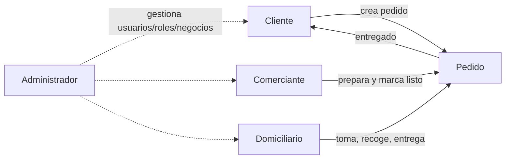

# 🗺️ Mapa de Actores — visión de conjunto

- [[Cliente]] inicia la demanda. [[Comerciante]] la satisface. [[Domiciliario]] la transporta.
  [[Administrador]] supervisa el ecosistema.
- El objeto que los conecta a todos es el **Pedido** ([[Lógica de Negocio]]).

## 🔗 Relacionado
- [[_MOC Actores]] · [[_MOC Diseño]]
