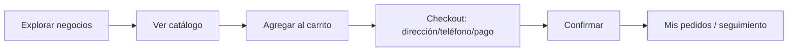
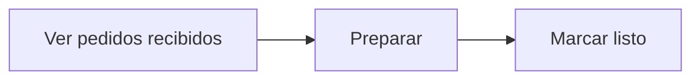
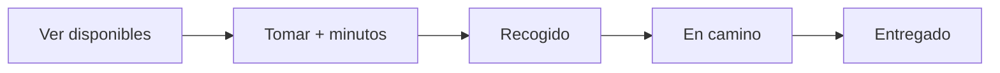

# 🔀 Flujos de Usuario

## Cliente — comprar

## Comerciante — atender

## Domiciliario — entregar

Ver el flujo unificado en [[Mapa de Actores]] y los estados en [[Lógica de Negocio]].

## 🔗 Relacionado
- [[_MOC Diseño]] · [[_MOC Casos de Uso]]
